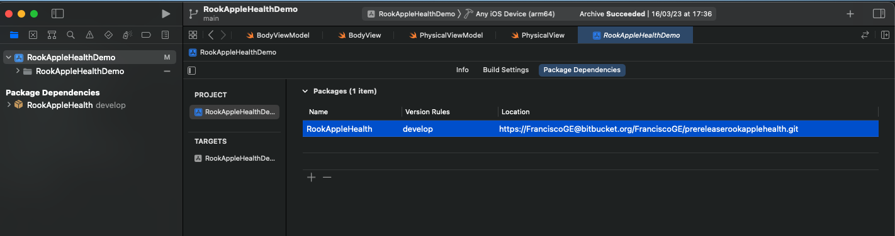
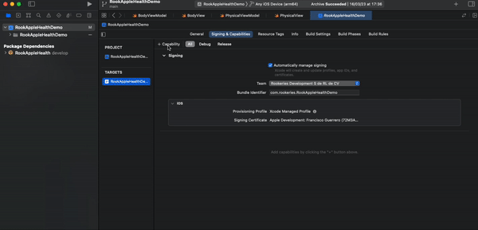
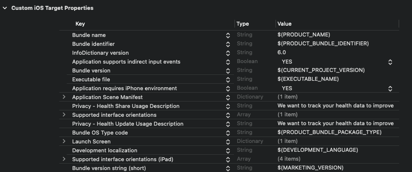

# Rook Apple Health  SDK

This SDK enables apps to extract data from Apple Health . `rook_apple_health_connect` is part of Rook Extraction, a series of SDKs dedicated to extracting Health Data from a variety of [Data Sources](https://docs.tryrook.io/docs/Definitions#data-sources).


## Features

- Check for Apple Health availability.
- Request permissions.
- Retrieve a [Sleep Summary](https://docs.tryrook.io/docs/DataStructure/SleepHealth#summaries) from a specific day.
- Retrieve a [Physical Summary](https://docs.tryrook.io/docs/DataStructure/PhysicalHealth#summaries) from a specific day.
- Retrieve a [Body Summary](https://docs.tryrook.io/docs/DataStructure/BodyHealth#summaries) from a specific day.

## Installation

To add a package dependency to your Xcode project, select File > Swift Packages > Add Package Dependency and enter the repository URL [https://github.com/RookeriesDevelopment/rook-ios-extraction-sdk](https://github.com/RookeriesDevelopment/rook-ios-extraction-sdk)



## Getting started

 To use Rook Apple Health SDK in your Xcode project, you need to follow these steps:

1. Add the HealthKit framework to your Xcode project:

- Open your project in Xcode.
- Click on your project file in the Project Navigator.
- Select your target and then click on the "Build Phases" tab.
- Click on the "+" button under the "Link Binary With Libraries" section and select "HealthKit.framework" from the list.



Then declare the privacy permissions used by this SDK. You will need to include the NSHealthShareUsageDescription and NSHealthUpdateUsageDescription keys in your app's Info.plist file. These keys provide a description of why your app needs to access HealthKit data and will be displayed to the user in the permission request dialog.

```text
<key>NSHealthShareUsageDescription</key>
<string>This app requires access to your health and fitness data in order to track your workouts and activity levels.</string>
<key>NSHealthUpdateUsageDescription</key>
<string>This app requires permission to write workout data to HealthKit.</string>
```




## Usage

To configure Rook Apple Health SDK, you need to follow this steps:

1. Import th apple health sdk

```swift
import RookAppleHealthExtraction
import RookAppleHealth
```

 2. Add your credentials. 
 - This method should be called at the beginning of your app's launch process.

```swift
func application(_ application: UIApplication
                 didFinishLaunchingWithOptions launchOptions: [UIApplication.LaunchOptionsKey : Any]? = nil) -> Bool {
    
    RookAHConfiguration.shared.setClientUUID(with: "9593d0ec-47c1-4477-a8ce-10d3f4f43127")
    RookAHConfiguration.shared.setEnvironment(.sandbox)
    RookAHConfiguration.shared.initRookAH()
    return true
}
```

### Configuration

#### RookAHConfiguration

`RookAHConfiguration` configures the sdk before start using the sdk set your client uuid and init the sdk.
This class conforms the singleton pattern to get access use the shared property. 

| Function | Description |
| -------- | ----------- |
| `setClientUUID(with uuid: String)` | Sets your client uuid to configure the sdk |
| `setEnvironment(_ environment: RookExtractionEnvironment)` | Sets your environment to configure the sdk |
| `initRookAH()` | Initializes the rook apple health sdk |
| `isAHAvailable() -> Bool` | Return a `Bool` indicating if the sdk is available |

**Note: If the environment is not set, the sdk will work in sandbox environment.**

### Permissions

#### Request

There are dedicated functions for each health pillar (Sleep, Physical, and Body) to request permissions. To call these methods you need to create a instance of the class ```RookAHPermissionManager```

| Function | Description |
| -------- | ----------- |
| `requestAllPermissions(completion: @escaping (Result<Bool, Error>)` | Sends a request for all the health permissions. |
| `requestSleepPermissions(completion: @escaping (Result<Bool, Error>) -> Void)` | Sends a request for the sleep permission. |
| `requestPhysicalPermissions(completion: @escaping (Result<Bool, Error>)` | Sends a request for the physical permissions. |
| `requestUserInfoPersmissions(completion: @escaping (Result<Bool, Error>) -> Void)` | Sends a request for the user information permissons. |
| `requesBodyPermissions(completion: @escaping (Result<Bool, Error>) -> Void)` | Sends a request for the body permissions. |

Example:

```swift

private let permissionManager = RookAHPermissionManager()

func requestBodyPermission() {
  permissionManager.requestBodyPermissions() { result in
      switch result {
      case .success(let success):
        debugPrint(success)
      case .failure(let error):
        debugPrint(error)
      }
  }
}

```

**Permissions denied**

If the user clicks cancel or navigates away from the permissions screen, Apple Health Connect will take it as undefined.

The user is able to enable or disable the permission in the settings app.


### Retrieving data

#### RookAHExtractionManager

To retrieve any type of summary, you need to provide a date. This date should not be the current day

To get health data, create a instance of the class `RookAHExtractionManager` that contains the following methods

| Method | Description |
| ------ | ----------- |
| getSleepSummay(date: Date, completion: @escaping (Result<RookSleepData?, Error>) -> Void) | Retrieves in the completion block the sleep data of the user or an error. |
| getPhysicalSummary(date: Date, completion: @escaping (Result<RookPhysicalData, Error>) -> Void) | Retrieves in the completion block the physical data of the user or an error. |
| getBodySummary(date: Date, completion: @escaping (Result<RookBodyData, Error>) -> Void) | Retrieves in the completion block the body data of the user or an error. |
| getUserInformation(date: Date, completion: @escaping (Result<RookUserInfoData, Error>)) | Retrieves in the completion block the user information data or an error. |
| getLastExtractionDate(of summary: RookDataType) -> Date? | Returns the last date extraction of the summary |
| getUserTimeZone(completion: @escaping (Result<RookUserTimeZone, Error>) -> Void) | Retrieves in the completion block the current user's time zone or an error. |

For example, if you want to get yesterday's sleep summary, call `getSleepSummary`. It will return a `RookSleepData` instance or return an error.

```swift
let extractionManager: RookAHExtractionManager = RookAHExtractionManager()

func getSleepSummary() {
  let date: Date = Date()
  extractionManager.getSleepSummay(date: date) { result in

    switch (result) {
      case .success(let data):
        if let data = data {
          debugPrint("sleep data \(data)")
        }
      case .failure(let error):
        debugPrint("error while fecthing sleep \(error)")
    }

  }

}

```

#### RookAHEventExtractionManager

The Access point all the event health data managed by RookAppleHealth.

**Note: All the data introduced manually in apple health container, will be ignored.**

Use `RookAHPermissionManager` object to request permission to read  health data from Health kit.
Once permission is granted, you can use the `RookAHEventExtractionManager` to fetch all events data

`RookAHExtractionManager`contains the methods listed bellow:

| Method | Description |
| ------ | ----------- |
| `getPhysicalHeartRateEvents(date: Date, completion: @escaping(Result<[RookHeartRateEvent],Error>) -> Void)` | Returns `[RookHeartRateEvent]` an array of objects with all the data of the heart rate events while the user was in a physical activity |
| `public func getBodyHeartRateEvents(date: Date, completion: @escaping(Result<[RookHeartRateEvent],Error>) -> Void)` | Returns `[RookHeartRateEvent]` an array of objects with all the data of the heart rate events while the user was not in a physical activity |
| `public func getPhysicalOxygenationEvents(date: Date, completion: @escaping(Result<[RookOxygentationEvent],Error>) -> Void)` | Returns `[RookOxygentationEvent]` an array of objects with all the data of the oxygenation events while the user was in a physical activity |
| `public func getBodyOxygenationEvents(date: Date, completion: @escaping(Result<[RookOxygentationEvent],Error>) -> Void)` | Returns `[RookOxygentationEvent]` an array of objects with all the data of the oxygenation events while the user was not in a physical activity |
| `public func getActivityEvents(date: Date, completion: @escaping (Result<[RookActivityEvent], Error>) -> Void)` | Returns `[RookActivityEvent]` an array of objects with all the data of the activity events |


### Keeping track of the last time a summary was retrieved

To help you retrieve the data of the days the user did not open your app. We store in preferences the last date data was retrieved from (even if that attempt resulted in no data being found).

#### Example

``` swift
let extractionManager: RookAHExtractionManager = RookAHExtractionManager()

func getLastSleepDate() {
  let date: Date? = extractionManager.getLastExtractionDate(of: RookDataType.sleepSummary)
}

```
